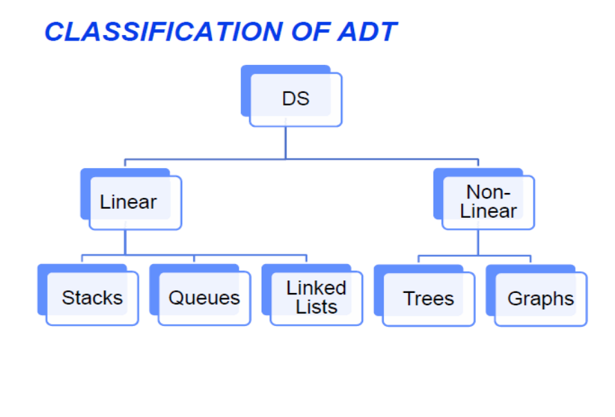
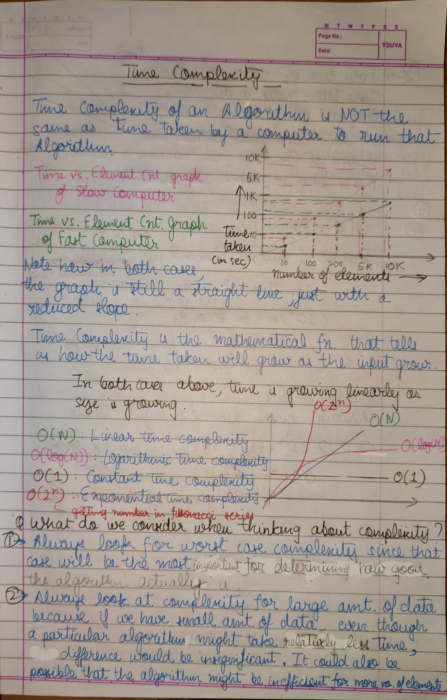
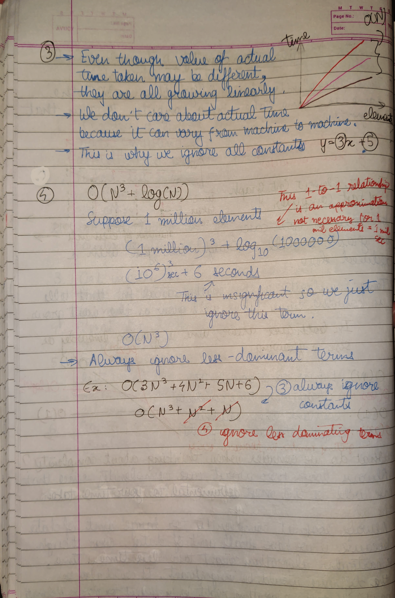
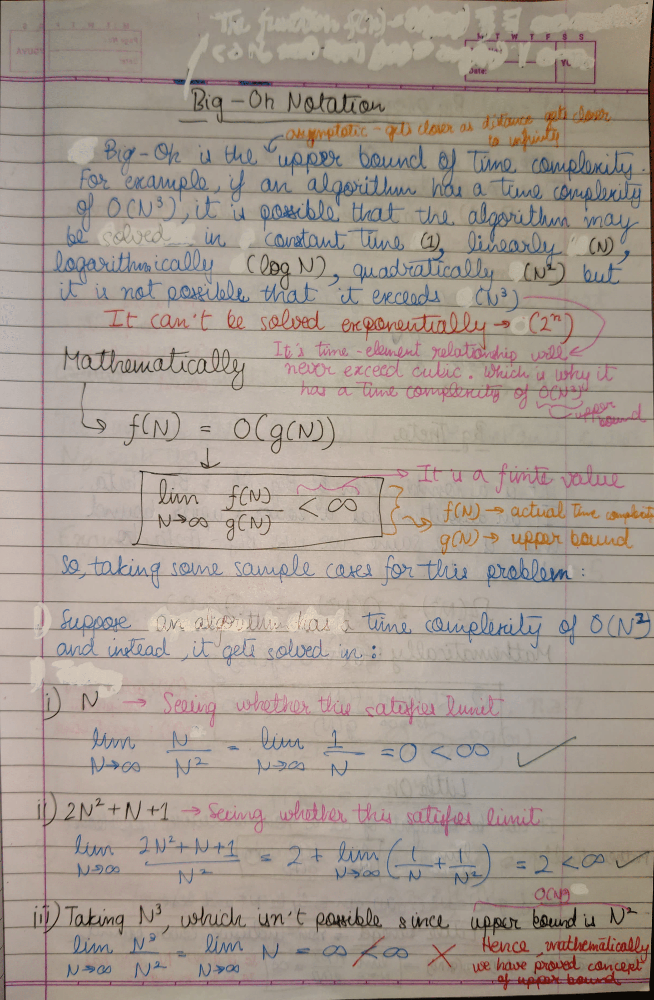
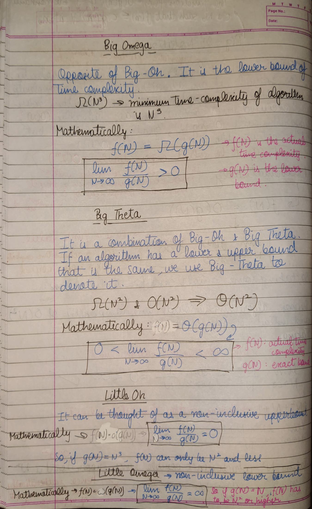

# INDEX

- [INDEX](#index)
- [Abstract Data Types](#abstract-data-types)
  - [Classification of Abstract Data Types](#classification-of-abstract-data-types)
- [Linked List](#linked-list)
  - [Linked List Implementation in CPP](#linked-list-implementation-in-cpp)
      - [More about `NULL`](#more-about-null)
- [Stack Abstract Data Type](#stack-abstract-data-type)
  - [Stack Operations](#stack-operations)
  - [Applications of Stacks](#applications-of-stacks)
    - [Infix to Postfix/Prefix](#infix-to-postfixprefix)
    - [Reversing Data](#reversing-data)
    - [Backtracking](#backtracking)
    - [Function calls](#function-calls)
  - [Stack Implementation in CPP](#stack-implementation-in-cpp)
- [Queue](#queue)
  - [Queue operations](#queue-operations)
  - [Queue implementation in CPP](#queue-implementation-in-cpp)
- [Time Complexity](#time-complexity)
- [Space Complexity](#space-complexity)
  - [What is Auxiliary Space?](#what-is-auxiliary-space)
  - [Using Auxiliary Space as a criteria instead of Space Complexity.](#using-auxiliary-space-as-a-criteria-instead-of-space-complexity)

# Abstract Data Types

An Abstract Data Type specifies:
- Data stored
- Operations on the data
- Error conditions associated with operations

## Classification of Abstract Data Types



# Linked List

There is no need for contiguous memory like in an array.

Each node consists of 2 things:
- Value stored in node. 
- Pointer pointing to memory of next node.

Head of linked list points to the first node.

The last node of the linked list points to a null value.

## Linked List Implementation in CPP

We define a `struct` containing an number as well as a pointer to the same `struct` (Self Referential structure).

We create a pointer of this `struct` type which is the 'head' pointer of the linked list.

The pointer of the last node is assigned the defined constant [`NULL`](#more-about-null), used as an end-marker for the linked list.

#### More about `NULL`

`NULL` is a defined constant that can be implicitly/explicitly type-casted to any pointer type. 

It is a pointer that doesn't point to any valid data object. 

Considering this code:
```cpp
#include <iostream>

int main() {
    int* integer = NULL;
    std::cout << integer << std::endl;
    printf("%p", integer);
    
    return 0;
}
```
The output of the following code will be:
```
0
(nil)
```

It is always a good practice to assign the pointer NULL to a pointer variable in case you do not have exact address to be assigned. 

This is done at the time of variable declaration. 

A pointer that is assigned `NULL` is called a null pointer.

# Stack Abstract Data Type

Stack is an ADT that manages data elements linearly but provides access to only one end i.e., data element can be inserted and removed from one end only.

It is a Last-in-First-Out data structure.

It consists of a an array whose size is set by the user and can't be changed along with a top pointer to point to the 'top of the stack' or the last filled element. 

## Stack Operations

- `create()` - 
- `push()` - for adding an element onto the top of the stack.
- `pop()` - for deleting an element from the top of stack and returning the element. -1 is returned when `pop()` fails.
- `peek()` - access the element at the top of the stack.
- `isempty()` - for checking whether the stack is empty before trying to pop. 
- `isfull()` - for checking whether the stack is full before trying to add an element.

## Applications of Stacks

### Infix to Postfix/Prefix


### Reversing Data

We can use stacks to reverse data. (example: files, strings).  Very useful for finding palindromes.

### Backtracking

It is an algorithmic technique for solving problems recursively by trying to build a solution incrementally, one piece at a time, removing those solutions that fail to satisfy the constraints of the problem at any point in time.

### Function calls

Stacks are used to implement function calls by creating a **stack frame** in memory where local variables are stored.

  As the scopes of the variables end, they are one-by-one popped out from the stack, with the return address at the bottom, after which the stack frame is removed from memory.
  
  Most compilers implement function calls by using a stack.
- Arithmetic expression evaluation: An important application of stacks is in parsing.
  
  In high level languages, infix notation can't be used to evaluate expressions. A common technique is to convert a infix notation into postfix notation, then evaluating it.

TODO: Understand java bytecode is evaluated on virtual stack based processor

## Stack Implementation in CPP

We can start entering elements from the end or the beginning of the array.

We usually implement the `top` pointer in a simple manner where `top` is just an integer with a value of the index of topmost element. The value of `top` is kept as -1 if the stack is empty. 

Stack implementation using Linked List

# Queue

- The `front` pointer points to the oldest element in the queue
- The `rear` pointer points to the newest element in the queue

- front is actually the first element of the array
- rear is actually the last element of the array

## Queue operations

- `isEmpty()` 
- `isFull()`
- `enQueue()`
- `deQueue()`
- `printQueue()`

## Queue implementation in CPP

It is opposite to the implementation of stacks using arrays. In stacks, the beginning of the array represented the bottom of the stack for easy pushing and popping.

Here the beginnning of the array is considered as the front of the queue over here.

The implementation of the `front` and `rear` pointers is usually kept simple by keeping them as integers storing values of indices.

Initially, `front` = -1 and `rear` = -1.

When one element is queued, front is -1 and rear is 0.

Whenever `front` = `rear`, queue is empty.


- Using arrays: Here, enqueueing and dequeueing is an O(1) operation but when the queue isn't full and an element has to be enqueued then shifting has to take place which is an O(n) operation.
- Using linked list: Here, both enqueueing and dequeueing is an O(1)
- Using other ADTs

# Time Complexity 









# Space Complexity 

Space Complexity of an algorithm is the total space taken by an algorithm withm respect to the input size. Space complexity includes both Auxiliary space and space used by input.

## What is Auxiliary Space?

Auxiliary space is the extra space or the temporary space used by an algorithm.

## Using Auxiliary Space as a criteria instead of Space Complexity.

We can't really do anything about the input we are taking, but we can choose what algorithm to use, depending on which takes up the least amount of memory.

For example, if we want to compare standard sorting algorithms on the basis of space, the auxiliary space would be a better criteria than Space Complexity. Merge Sort uses O(n) auxiliary space, Insertion sort and Heap Sort use O(1) auxiliary space. 

Space complexity of all these sorting algorithms is O(n) though.


