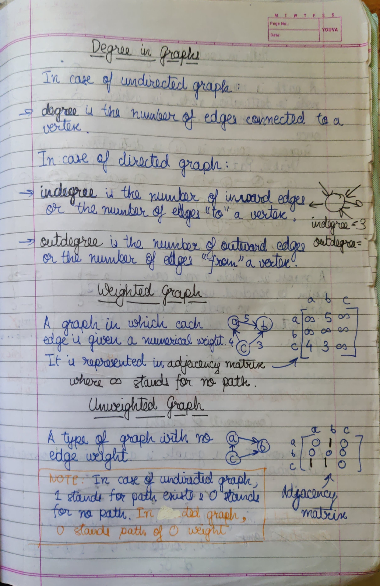

# INDEX

- [INDEX](#index)
- [Time Complexity](#time-complexity)
  - [Cheat Sheet for various Best, Worst and Average case Time Complexities](#cheat-sheet-for-various-best-worst-and-average-case-time-complexities)
- [Space Complexity](#space-complexity)
  - [What is Auxiliary Space?](#what-is-auxiliary-space)
  - [Using Auxiliary Space as a criteria instead of Space Complexity.](#using-auxiliary-space-as-a-criteria-instead-of-space-complexity)
- [Recursion](#recursion)
  - [How to understand & approach problems](#how-to-understand--approach-problems)
  - [Recursion Tree](#recursion-tree)
  - [Types of Recurrence Relation](#types-of-recurrence-relation)
    - [Linear Recurrence Relation](#linear-recurrence-relation)
    - [Divide & Conquer Recurrence Relation](#divide--conquer-recurrence-relation)
  - [Tail-end recursive functions](#tail-end-recursive-functions)
    - [Factorial calculator using regular vs. tail recursion](#factorial-calculator-using-regular-vs-tail-recursion)
  - [How function calls work in languages](#how-function-calls-work-in-languages)
  - [Complexity Analysis in Recursive Algorithms](#complexity-analysis-in-recursive-algorithms)
    - [Space Complexity (Auxiliary Space in ACTUALITY)](#space-complexity-auxiliary-space-in-actuality)
  - [Tower of Hanoi problem](#tower-of-hanoi-problem)
- [Dynamic Programming](#dynamic-programming)
- [Arrays](#arrays)
- [Abstract Data Types](#abstract-data-types)
  - [Classification of Abstract Data Types](#classification-of-abstract-data-types)
- [Linear Abstract Datatypes](#linear-abstract-datatypes)
  - [Linked List](#linked-list)
    - [Linked List Implementation in CPP](#linked-list-implementation-in-cpp)
      - [More about `NULL`](#more-about-null)
  - [Stack](#stack)
    - [Stack Operations](#stack-operations)
    - [Applications of Stacks](#applications-of-stacks)
      - [**Infix to Postfix/Prefix**](#infix-to-postfixprefix)
      - [**Reversing Data**](#reversing-data)
      - [**Backtracking**](#backtracking)
      - [**Function calls**](#function-calls)
    - [Stack Implementation in CPP](#stack-implementation-in-cpp)
  - [Queue](#queue)
    - [Queue operations](#queue-operations)
    - [Queue implementation in CPP](#queue-implementation-in-cpp)
    - [Double-Ended Queue](#double-ended-queue)
      - [**Input Restricted DE-Queue**](#input-restricted-de-queue)
      - [**Output Restricted DE-Queue**](#output-restricted-de-queue)
    - [Drawbacks of Queue implemented using Arrays](#drawbacks-of-queue-implemented-using-arrays)
    - [Circular Queue](#circular-queue)
      - [Need of `numOfElements` member in Circular Queues](#need-of-numofelements-member-in-circular-queues)
- [Non-Linear Abstract Data Types](#non-linear-abstract-data-types)
  - [Graphs](#graphs)
    - [Graph Traversals](#graph-traversals)
      - [**Depth First Search**](#depth-first-search)
      - [**Breadth First Search**](#breadth-first-search)
  - [Trees](#trees)
    - [Tree Traversal Algorithms (Applicable for all types of Trees, including B-trees)](#tree-traversal-algorithms-applicable-for-all-types-of-trees-including-b-trees)
      - [**Pre-order Traversal**](#pre-order-traversal)
      - [**In-order Traversal**](#in-order-traversal)
      - [**Post-order Traversal**](#post-order-traversal)
      - [**Level-order Traversal**](#level-order-traversal)
    - [Binary Trees](#binary-trees)
    - [Binary Search Trees](#binary-search-trees)
    - [AVL Trees (Self-balancing BSTs)](#avl-trees-self-balancing-bsts)
    - [Tree Searching Algorithms (TODO)](#tree-searching-algorithms-todo)
    - [Heaps](#heaps)
      - [Heap Sort](#heap-sort)
      - [Priority Queues using Heaps](#priority-queues-using-heaps)
      - [Heapify](#heapify)
    - [B-Trees](#b-trees)
      - [Application of B-Trees](#application-of-b-trees)
- [Sorting Algorithms](#sorting-algorithms)
  - [Stable vs. Unstable Sorting Algorithms](#stable-vs-unstable-sorting-algorithms)
  - [In-place Sorting Algorithms](#in-place-sorting-algorithms)
  - [Bubble Sort (Sinking Sort OR Exchange Sort)](#bubble-sort-sinking-sort-or-exchange-sort)
    - [Time Complexity](#time-complexity-1)
      - [Best case - O(N)](#best-case---on)
      - [Worst case - O(N<sup>2</sup>)](#worst-case---onsup2sup)
  - [Selection Sort](#selection-sort)
    - [Why use Selection Sort?](#why-use-selection-sort)
    - [Time Complexity](#time-complexity-2)
      - [Best case - O(N<sup>2</sup>) & Worst case - O(N<sup>2</sup>)](#best-case---onsup2sup--worst-case---onsup2sup)
  - [Insertion Sort](#insertion-sort)
    - [Why use Insertion Sort?](#why-use-insertion-sort)
    - [Time Complexity](#time-complexity-3)
      - [Best case - O(N)](#best-case---on-1)
      - [Worst case - O(N<sup>2</sup>)](#worst-case---onsup2sup-1)
  - [Merge Sort](#merge-sort)
    - [Steps followed in Merge Sort](#steps-followed-in-merge-sort)
    - [Time Complexity of Merge Sort](#time-complexity-of-merge-sort)
      - [Solving using Recursion Tree Method](#solving-using-recursion-tree-method)
      - [Solving Recurrence Relation using Akra-Bazzi Theorem](#solving-recurrence-relation-using-akra-bazzi-theorem)
      - [Best case - O(N.logN) & Worst case - O(N.logN)](#best-case---onlogn--worst-case---onlogn)
    - [Space Complexity of Merge Sort](#space-complexity-of-merge-sort)
      - [In-place Merge Sort](#in-place-merge-sort)
      - [Not in-place Merge Sort](#not-in-place-merge-sort)
  - [Quick Sort](#quick-sort)
    - [What is Pivot?](#what-is-pivot)
    - [Picking a Pivot](#picking-a-pivot)
    - [Time Complexity](#time-complexity-4)
      - [Recurrence Relation](#recurrence-relation)
      - [Best case - O(N.logN)](#best-case---onlogn)
      - [Worst case - O( N<sup>2</sup> )](#worst-case---o-nsup2sup-)
    - [Why use Quick Sort?](#why-use-quick-sort)
  - [Hybrid Sorting Algorithms](#hybrid-sorting-algorithms)
- [Searching Algorithms](#searching-algorithms)
- [Binary Search](#binary-search)
  - [Time Complexity](#time-complexity-5)
    - [Recurrence Relation](#recurrence-relation-1)
    - [Best case - O(1)](#best-case---o1)
    - [Worst case - O(log<sub>2</sub>N)](#worst-case---ologsub2subn)
- [Rotated Binary Search](#rotated-binary-search)
- [Hashing (using Hash Functions :P)](#hashing-using-hash-functions-p)
  - [Use of Hashing](#use-of-hashing)
  - [Hash Table](#hash-table)
  - [Collisions in Hashing](#collisions-in-hashing)
    - [1. Collision resolution by chaining](#1-collision-resolution-by-chaining)
    - [2. Open Addressing: Linear/Quadratic Probing and Double Hashing](#2-open-addressing-linearquadratic-probing-and-double-hashing)
- [Tips & Tricks for DSA](#tips--tricks-for-dsa)
  - [Calculating the no. of digits in a number](#calculating-the-no-of-digits-in-a-number)
  - [Calculating the approximate number of times a loop runs](#calculating-the-approximate-number-of-times-a-loop-runs)
  - [Calculating `N`th Fibonacci number (regular recursion vs. recurrence relation formula)](#calculating-nth-fibonacci-number-regular-recursion-vs-recurrence-relation-formula)
    - [Regular Recursion](#regular-recursion)
    - [Recurrence Relation Formula](#recurrence-relation-formula)
  - [Concept of Circular Incrementation](#concept-of-circular-incrementation)
- [TODO](#todo)

# Time Complexity 


## Cheat Sheet for various Best, Worst and Average case Time Complexities

Access it [here](https://www.bigocheatsheet.com/).

# Space Complexity 

Space Complexity of an algorithm is the total space taken by an algorithm withm respect to the input size. Space complexity includes both Auxiliary space and space used by input.

## What is Auxiliary Space?

Auxiliary space is the extra space or the temporary space used by an algorithm.

## Using Auxiliary Space as a criteria instead of Space Complexity.

We can't really do anything about the input we are taking, but we can choose what algorithm to use, depending on which takes up the least amount of memory.

For example, if we want to compare standard sorting algorithms on the basis of space, the auxiliary space would be a better criteria than Space Complexity. Merge Sort uses O(n) auxiliary space, Insertion sort and Heap Sort use O(1) auxiliary space. 

Space complexity of all these sorting algorithms is O(n) though.

# Recursion

- It helps us in solving bigger/complex problems in a simpler way.
- You can convert recursion solution into iteration and vice versa.
  
  So, solve complex problems using recursion and the convert into recursion to get a more optimized answer.
- Space complexity is higher. For example, if suppose we print 1000 numbers using recursion, 1000 function calls will go into the stack memory, so space complexity will be O(N). 

  On the other hand, if we print 1000 numbers using loops, the task will be done in constant space complexity O(1) because only a loop variable will be required for storage and it will be updated with each iteration.

## How to understand & approach problems

- Identify if you can break down the problem into smaller problems.
- Write down the recurrence relation if needed. 
- Draw the recursion tree.
- About the tree:
  - See the flow of functions, how they are getting in stack.
  - Identify and focus on left tree calls and right tree calls.    
- Draw the tree and pointers again & again using pen and paper.
- Use a debugger to see the flow.
- See how and what type of values are returned at each step. 
- See at which step, the function call actually finally returns a value.

## Recursion Tree

<!-- TODO -->

## Types of Recurrence Relation

### Linear Recurrence Relation

Fibonacci Recurrence Relation
```
Fibo(N) = Fibo(N - 1) + Fibo(N - 2)
``` 

Here, the argument is getting reduced LINEARLY, which is why it is referred to as Linear Recurrence Relation.

This is quite inefficient because the argument is getting reduced very slowly and at a constant rate. In comparison, in Divide & Conquer Recurrence Relations, division/multiplication by a factor results in exponential change which is much faster and efficient.

### Divide & Conquer Recurrence Relation

Divide-and-conquer algorithms consist of:
1. Dividing the problem into smaller sub-problems. 
2. Solving those sub-problems
3. Combining the solutions for those smaller sub-problems to solve the original problem
   
NOTE that the sub-problems should be of the same type as the main problem. 
   
For example, if the main problem is of SORTING an array, the sub-problem can ONLY be SORTING a part of the array.

Recurrence Relation for Binary Search
```
Search(N) = O(1) + Search(N/2)
```
Here, when we try to search for an element using Binary Search, a comparison takes place (in constant time) between the element to be found and the element in the middle of the array, which explains the **O(1)** term.

After it is determined whether the element to be found is greater or lesser than the middle point, a `Search` operation is again initiated at either the first or second half of the array, which explains the **Search(N/2)** term.

Since the search space is DIVIDED by a factor, it is referred to as a Divide & Conquer Recurrence Relation.

## Tail-end recursive functions
 
The tail recursion is basically using the recursive function as the last statement of the function. So when nothing is left to do after coming back from the recursive call, that is called tail recursion. We will see one example of tail recursion.

For example, if suppose we return (2 + function call), that 2 will be stored somewhere in memory when stack frame of the function, from which the value is being returned, is destroyed. 

So instead, we find a way to pass that 2 somehow into the recursive function call.

### Factorial calculator using regular vs. tail recursion

Factorial calculator using regular recursion:
```cpp
#include <iostream>

int fact(int n) {
  if (n == 1) {
    return 1;
  };

  return fact(n - 1) * n;
}
```

In this case, suppose n = 5, the recursive call will make the return value occupy more and more memory until the base condition (n = 1) is reached.

This is how the return value looks with changing **n**.
```
( fact(4) * 5 );
( ( fact(3) * 4 ) * 5 );
( ( ( fact(2) * 3 ) * 4 ) * 5 );
( ( ( ( fact(1) * 2 ) * 3 ) * 4 ) * 5 );
( ( ( ( 1 * 2 ) * 3 ) * 4 ) * 5 );
( ( ( 2 * 3 ) * 4 ) * 5 );
( ( 6 * 4 ) * 5 );
( 24 * 5 );
120;
```

Factorial calculator using tail-end recursion:
```cpp
#include <iostream>

int fact(int n, int result) {
  if(n == 1) {
    return result;
  }
  return fact(n-1, result * n);
}
```

In this case, suppose we take n = 5 and a = 1, the return value looks something like this:
```
fact(5-1,  1 * 5);
fact(4-1,  5 * 4);
fact(3-1, 20 * 3);
fact(2-1, 60 * 2);
120;
```
Here, as we can see, only the parameters of the function that is getting returned are getting changed, until the base condition (n = 1) is reached. So space complexity in the memory stack is O(1). 

## How function calls work in languages

While the function is not finished executing, it will remain in stack.

When a function finishes executing, it is removed from the stack and the flow of the program is returned to the point where the function was called.

## Complexity Analysis in Recursive Algorithms

### Space Complexity (Auxiliary Space in ACTUALITY)


As the recursive functions are calling itself again and again, addresses are added into stack. So, if the function is called **N** times recursively, it will take $O(N)$ auxiliary space.

## Tower of Hanoi problem


# Dynamic Programming

Dynamic Programming is a technique in computer programming that helps to efficiently solve a class of problems that have overlapping subproblems and optimal substructure property.

If any problem can be divided into sub-problems, which in turn are divided into smaller sub-problems, and if there are overlapping among these sub-problems, then the solutions to these sub-problems can be saved for future reference. 

In this way, efficiency of the CPU can be enhanced. This method of solving a solution is referred to as dynamic programming.

See examples of question solved using dynamic programming under the `dynamic-programming` directory.

# Arrays

An array is a homogenous data structure: all elements are of the same type. Also, the elements of an array are stored in adjacent memory locations. 

Because each cell has the same type (and thus the same size), and because the cells are adjacent in memory, it is possible to quickly calculate the address of any array cell, given the address of the first cell, which is why arrays are good for RANDOM ACCESS of elements.

Say we allocate memory for an array of `N` elements (the total number of cells of the array must be defined beforehand), where the elements of the array are of a type that has a size of `b` bytes (e.g. a C++ int has a size of 4 bytes), and the resulting array is allocated starting at memory address `x`. 

Using 0-based indexing:
- the element at index `i = 0` is at memory address `x`
- the element at index `i = 1` is at memory address `x + b`
- the element at index `i` is at memory address `x + bi`. 

Below is the same example array, where the number inside each cell is the index of that cell, and the number below each cell is the memory address at which that cell begins.


# Abstract Data Types

An Abstract Data Type specifies:
- Data stored
- Operations on the data
- Error conditions associated with operations

## Classification of Abstract Data Types


# Linear Abstract Datatypes

## Linked List

There is no need for contiguous memory like in an array.

Each node consists of 2 things:
- Value stored in node. 
- Pointer pointing to memory of next node.

Head of linked list points to the first node.

The last node of the linked list points to a null value.

### Linked List Implementation in CPP

We define a `struct` containing an number as well as a pointer to the same `struct` (Self Referential structure).

We create a pointer of this `struct` type which is the 'head' pointer of the linked list.

The pointer of the last node is assigned the defined constant [`NULL`](#more-about-null), used as an end-marker for the linked list.

#### More about `NULL`

`NULL` is a defined constant that can be implicitly/explicitly type-casted to any pointer type. 

It is a pointer that doesn't point to any valid data object. 

Considering this code:
```cpp
#include <iostream>

int main() {
    int* integer = NULL;
    std::cout << integer << std::endl;
    printf("%p", integer);
    
    return 0;
}
```
The output of the following code will be:
```
0
(nil)
```

It is always a good practice to assign the pointer NULL to a pointer variable in case you do not have exact address to be assigned. 

This is done at the time of variable declaration. 

A pointer that is assigned `NULL` is called a null pointer.

---

## Stack

Stack is an ADT that manages data elements linearly but provides access to only one end i.e., data element can be inserted and removed from one end only.

It is a Last-in-First-Out data structure.

It consists of an array whose size is set by the user and can't be changed along with a top pointer to point to the 'top of the stack' or the last filled element. 

### Stack Operations

- `create()` - 
- `push()` - for adding an element onto the top of the stack.
- `pop()` - for deleting an element from the top of stack and returning the element. -1 is returned when `pop()` fails.
- `peek()` - access the element at the top of the stack.
- `isEmpty()` - for checking whether the stack is empty before trying to pop. 
- `isFull()` - for checking whether the stack is full before trying to add an element.

### Applications of Stacks

#### **Infix to Postfix/Prefix**

TODO

#### **Reversing Data**

We can use stacks to reverse data. (example: files, strings).  Very useful for finding palindromes.

#### **Backtracking**

It is an algorithmic technique for solving problems recursively by trying to build a solution incrementally, one piece at a time, removing those solutions that fail to satisfy the constraints of the problem at any point in time.

#### **Function calls**

Stacks are used to implement function calls by creating a **stack frame** in memory where local variables are stored.

  As the scopes of the variables end, they are one-by-one popped out from the stack, with the return address at the bottom, after which the stack frame is removed from memory.
  
  Most compilers implement function calls by using a stack.
- Arithmetic expression evaluation: An important application of stacks is in parsing.
  
  In high level languages, infix notation can't be used to evaluate expressions. A common technique is to convert a infix notation into postfix notation, then evaluating it.

TODO: Understand java bytecode is evaluated on virtual stack based processor

### Stack Implementation in CPP

We can start entering elements from the end or the beginning of the array.

We usually implement the `top` pointer in a simple manner where `top` is just an integer with a value of the index of topmost element. The value of `top` is kept as -1 if the stack is empty. 

TODO: Stack implementation using Linked List

---

## Queue

- The `front` pointer points to the oldest element in the queue
- The `rear` pointer points to the newest element in the queue

- front is actually the first element of the array
- rear is actually the last element of the array

### Queue operations

- `isEmpty()` 
- `isFull()`
- `enQueue()`
- `deQueue()`
- `printQueue()`

### Queue implementation in CPP

It is opposite to the implementation of stacks using arrays. In stacks, the beginning of the array represented the bottom of the stack for easy pushing and popping.

Here the beginnning of the array is considered as the front of the queue over here.

The implementation of the `front` and `rear` pointers is usually kept simple by keeping them as integers storing values of indices.

Initially, `front` = -1 and `rear` = -1.

When one element is queued, front is -1 and rear is 0.

Whenever `front` = `rear`, queue is empty.


1. Using arrays: Here, enqueueing and dequeueing is an *O(1)* operation. 

   But, there can be a case where the queue isn't full, but due to dequeueing, there is extra space at the start of the array.
   
   In this situation, enqueueing an element requires shifting of elements towards the beginning of the array, making enqueueing an *O(N)* operation.

2. Using linked list: Here, both enqueueing and dequeueing is an *O(1)*.
3. Using other ADTs

### Double-Ended Queue

A double-ended queue is similar to a [Queue ADT](#queue) with the added functionality of being able to enqueue and dequeue from both ends of the queue.

DE-queues can further be classified into two types:

#### **Input Restricted DE-Queue**

In restricted INPUT DE-Queue, enqueueing from front is NOT permitted, however dequeueing from end is permitted.

#### **Output Restricted DE-Queue**

In restricted OUTPUT DE-Queue, dequeueing from end is NOT permitted, however enqueueing from front is permitted.

### Drawbacks of Queue implemented using Arrays

- Space is not used efficiently.
- The queue may not be full but the rear pointer may reach the end, requiring us to shift elements for enqueueing to take place.

### Circular Queue

A circular queue is the extended version of a regular queue where the last element is connected to the first element. Thus forming a circle-like structure. The circular queue solves the major limitations of the normal queue, listed [above](#drawbacks-of-queue-implemented-using-arrays).


Coming to the indexing of the circular queue (the below indexing is based on an array that has space for 5 elements): 

Unlike normal queues where initially, `front` = -1 and `rear` = -1, and when one element is queued, `front` is still -1 and `rear` is 0; in the case of circular queues, both `front` and `rear` are equal to the last index in the array.

So initially, `front` = 4 and `rear` = 4.

When one element is queued `front` is still 4 and `rear` is 0.

#### Need of `numOfElements` member in Circular Queues

In a regular queue, when the queue is full, the `front` pointer is -1 and `rear` pointer is 4. So subtracting `rear` from `front` give us `size` which is 5, indicating that the queue is full.

But, in the case of circular queues there are two possible situations when `front` = `rear`:

- Either there are no elements in the circular queue.
- Or, the circular queue is full. 
  
  If suppose after the circular queue is created (`front` = `rear` = 4), 5 elements are enqueued one-by-one, without any dequeueing taking place. At the end of this, the `front` pointer would be 4 and the `rear` pointer would also be 4. 

  So, this leads to confusion whether the circular queue is empty or full.

To solve this confusion, we need an additional member that tells us the number of elements in the circular queue. 

This variable is incremented/decremented as elements are enqueued/dequeued.

# Non-Linear Abstract Data Types

## Graphs




### Graph Traversals

#### **Depth First Search**

Once a possible path is found, continue the search until the end of the path.

#### **Breadth First Search**

Start several paths at a time, and advance in each one step at a time

## Trees


### Tree Traversal Algorithms (Applicable for all types of Trees, including B-trees)


With rooted binary trees (and rooted trees in general), we typically only maintain a pointer to the root because all other nodes in the tree can be accessed via some traversal starting at the root.

Because we typically only keep track of the root node, to traverse all of the nodes in a rooted binary tree, there are four traversal algorithms: 

- [pre-order](#pre-order-traversal)
- [in-order](#in-order-traversal)
- [post-order](#post-order-traversal)
- [level-order](#level-order-traversal)


In all four, the verb "visit" simply denotes whatever action we perform when we are at a given node **u** (whether it be printing **u**'s label, or modifying **u** in some way, or incrementing some global count, etc.).

Take the following example of a Tree:
```
  1
 / \
2   3
   / \
  4   5
```

---

#### **Pre-order Traversal**

1. First visit the current node
2. Then recurse on the left child (if one exists)
3. Then recurse on the right child (if one exists) 

Put simply, **VLR** (Visit-Left-Right). 

In the example above, a pre-order traversal starting at the root would visit the nodes in the following order: 1 2 3 4 5

---

#### **In-order Traversal**

1. First recurse on the left child (if one exists)
2. Then visit the current node
3. Then recurse on the right child (if one exists)

Put simply, **LVR** (Left-Visit-Right). 

In the example above, an in-order traversal starting at the root would visit the nodes in the following order: 2 1 4 3 5

---

#### **Post-order Traversal**

1. First recurse on the left child (if one exists)
2. Then recurse on the right child (if one exists)
3. Then visit the current node
   
Put simply, **LRV** (Left-Right-Visit). 

In the example above, a post-order traversal starting at the root would visit the nodes in the following order: 2 4 5 3 1

---

#### **Level-order Traversal**

1. Visit nodes level-by-level (where the root is the "first level," its children are the "second level," etc.).
2. On a given level, visit nodes left-to-right. 

In the example above, a level-order traversal starting at the root would visit the nodes in the following order: 1 2 3 4 5

> NOTE: This is achievable when Binary Tree is stored as an Array. Printing the array in sequence would give us level-order traversal.

---

### Binary Trees


---

### Binary Search Trees


### AVL Trees (Self-balancing BSTs)


### Tree Searching Algorithms (TODO)

- Depth-First Search
- Breadth-First Search

---

### Heaps


#### Heap Sort


#### Priority Queues using Heaps


#### Heapify 


---

### B-Trees

A B-Tree is a self-balancing ***m-way*** tree data structure that allows searches, accesses, insertions, and deletions in logarithmic time. 

Each node in a B-Tree of order ***m*** can have, at most, ***m*** children and ***m-1*** keys. 

In addition to having multiple children, each node in a B-Tree can have more than one key, which keeps the height of the tree relatively small. This helps with data locality​.


In summary, a B-Tree of the order ***m*** has the following properties:

- each node has at most ***m*** children
- a node with ***n*** children must have ***n-1*** keys
- all leaf nodes are at the same level
- every node, except the root, is at least half full
- root has at least two children if it is not a leaf

Read more about it [here](https://www.educative.io/answers/what-is-a-b-tree).

#### Application of B-Trees

Let us take a case where we wish to store a large amount of data in a tree, that cannot possible fit entirely in our main memory (i.e., RAM) and we would need to use secondary storage devices (e.g., hard disk).

Since the data cannot fit entirely in main memory, it is read from a disk in contiguous chunks or blocks, and written to main memory for processing. 

However, reading from a disk is costly as disk access times are far higher than memory access times.

> ***NOTE:*** Secondary storage devices, like spinnable disks have slower disk access speeds, but have a larger capacity than the main memory (i.e., RAM).

Regular Tree ADTs such as a binary search tree, avl tree, red-black tree, etc can store only one key in one node. 

If you have to store a large number of keys, then the height of such trees becomes very large. Due to this, the access time increases because nodes are individually read from memory, one-by-one.

Height of a tree gives us the maximum number of edges from the root node to a leaf. So, in the worst case scenario, for reaching the leaf node of a tree of height `h`, `h` disk accesses (dereferencing and accessing each node) would be required.

However, B-tree can store many keys in a single node and can have multiple child nodes. 

They also have a high branching factor, meaning the trees are fat with a *relatively small* height, which ensures minimal disk reads to navigate​ to the place where the data is stored, for performing its operations, such as **insertion** and **searching**.


B-Trees are, therefore, well-suited for storage systems that read and write large blocks of data.

# Sorting Algorithms

An in-place algorithm is an algorithm that does not need an extra space and produces an output in the same memory that contains the data by transforming the input 'in-place'. 

However, a small constant extra space used for variables is allowed.

## Stable vs. Unstable Sorting Algorithms


**Stable sorting algorithms** preserve the relative order of equal elements, while **unstable sorting algorithms** don't. 

In other words, stable sorting maintains the position of two equals elements relative to one another.

## In-place Sorting Algorithms

An in-place sorting algorithm uses constant space for producing the output (modifies the given array only). 

It sorts the list only by modifying the order of the elements within the list. 

For example, [Insertion Sort](#insertion-sort) and [Selection Sort](#selection-sort) are in-place sorting algorithms as they do not use any additional space for sorting the list. 

A typical implementation of [Merge Sort](#merge-sort) is not in-place, also the implementation for counting sort is not an in-place sorting algorithm

## Bubble Sort (Sinking Sort OR Exchange Sort)

This sorting technique is just like bubbles in a water column, coming up one by one. 


In bubble sort, with each subsequent pass, the next largest element is settled at the end of the array.

In each subsequent pass, we reduce our domain of comparison by 1 because 1 additional element is placed in its sorted position after each pass.

It is a [stable sorting algorithm](#stable-vs-unstable-sorting-algorithms) as well as an [in-place sorting algorithm](#in-place-sorting-algorithms).

### Time Complexity

#### Best case - O(N)

When the array is already sorted, only one pass is run, which includes **(N-1)** comparisons.

So, it takes minimum amount of time (order of N).

This is implemented using a `swap` variable which keeps track of how many swaps occur in a single pass. 
```cpp
if(swap == 0) { 
    break;
}
else { 
    swap = 0;
};
```
- If no swaps occur in a particular pass, then it is clear that the array is already sorted and we need not make any more passes.
- Else, we reset the swap variable for the next pass.

#### Worst case - O(N<sup>2</sup>)

When the array is already sorted, but in reverse order.


## Selection Sort

The selection sort algorithm sorts an array by repeatedly finding the maximum element (considering ascending order) from unsorted part and putting it at the end. 

The algorithm maintains two subarrays in a given array.

- The subarray which is already sorted. 
- Remaining subarray which is unsorted.

It is an [unstable sorting algorithm](#stable-vs-unstable-sorting-algorithms) as well as an [in-place sorting algorithm](#in-place-sorting-algorithms).

### Why use Selection Sort?

- The good thing about selection sort is that never makes more than *(N-1)* swaps which is a linear i.e., *O(N)* complexity, so it can be useful when memory write is a costly operation.
- It performs well for smaller values of N. 

### Time Complexity

The average time complexity is *O(N<sup>2</sup>)*.


#### Best case - O(N<sup>2</sup>) & Worst case - O(N<sup>2</sup>)

In both the Best and Worst case, all the comparisons will still be made for finding the index position of the next largest element so the time complexity will be almost the same as the average case.

Minor difference can be no time spent in swap operations in the Best Case and all possible swap operations performed in Worst Case.

## Insertion Sort

Insertion sort is a simple sorting algorithm that works similar to the way you sort playing cards in your hands. 

The array is virtually split into a sorted and an unsorted part. Values from the unsorted part are gradually inserted place-by-place into the sorted part until they reach their correct position.

After every pass, a larger and larger portion of the array would be sorted.


It is a [stable sorting algorithm](#stable-vs-unstable-sorting-algorithms) as well as an [in-place sorting algorithm](#in-place-sorting-algorithms).

### Why use Insertion Sort?

- It is adaptive as steps get reduced if array is already sorted.
- It is used for smaller values of N. 
- It works well when array is partially sorted.
- It takes part in hybrid sorting algorithms.

### Time Complexity

#### Best case - O(N)

When the array is already sorted, only comparison takes place per pass. Number of passes is **(N-1)** so total comparisons are also **(N-1)**

So, it takes minimum amount of time (order of N).


#### Worst case - O(N<sup>2</sup>)

When the array is already sorted, but in reverse order.


## Merge Sort

### Steps followed in Merge Sort

- Divide array into 2 parts
- Get both parts sorted via recursion
- Merge the sorted parts

### Time Complexity of Merge Sort

#### Solving using Recursion Tree Method

TODO: correct logic of this


#### Solving Recurrence Relation using Akra-Bazzi Theorem


#### Best case - O(N.logN) & Worst case - O(N.logN)

The time complexity of MergeSort is $O(N.\log{N})$ in all the 3 cases (worst, average and best) as the merge sort algorithm always divides the array into two halves and takes linear time to merge two halves.

### Space Complexity of Merge Sort


#### In-place Merge Sort


#### Not in-place Merge Sort


## Quick Sort

It is a [Divide and Conquer](#divide--conquer-recurrence-relation) algorithm. 

It uses the concept of a [**pivot**](#what-is-pivot) for sorting.

It is an [unstable sorting algorithm](#stable-vs-unstable-sorting-algorithms) as well as an [in-place sorting algorithm](#in-place-sorting-algorithms).

### What is Pivot?

Quick Sort works by selecting an element called a pivot and placing the pivot element at the correct position after each pass.

Once an element is chosen as a pivot:
- All elements lesser than the pivot will be on the LHS of the pivot.
- All elements greater than the pivot will be on the RHS of the pivot.

It is NOT necessary that the two parts of the array (LHS and RHS of pivot) are sorted. Only the pivot is at its correct position within the array.

### Picking a Pivot

There are many different versions of quick sort that pick [pivot](#what-is-pivot) in different ways. 

- Always pick the first element as a pivot.
- Always pick the last element as a pivot (implemented below)
- Pick a random element as a pivot.
- Pick median as the pivot.

We use 4 variables in quick sort:
- `start` : This is the starting index of the partitioned array.
- `end` : This is the ending index of the partitioned array.
- `left` : This is a dynamic variable used to swap elements which are greater than the pivot, but are present on the LHS of the pivot.
- `right` : This is a dynamic variable used to swap elements which are less than the pivot, but are present on the RHS of the pivot.

### Time Complexity

#### Recurrence Relation


#### Best case - O(N.logN)


#### Worst case - O( N<sup>2</sup> )


### Why use Quick Sort?

- An advantage Quick Sort has over [Merge Sort](#merge-sort) is that if an array is already sorted, Merge Sort will still run till the base condition (the sub-array has only 1 element) is reached, and merge the sub-arrays back to the original array by comparing the elements of the sub-arrays. 
  
  Here, that will NOT happen. The only process happening will be incrementation of the left and right pointers.
  
  TODO: How?

- For arrays, Quick Sort is preferred over Merge Sort, because Merge Sort takes O(N) extra space.

  But, in the case of linked lists, memory allocation is random so Merge Sort is preferred over Quick Sort. 
  TODO: Why?

## Hybrid Sorting Algorithms

The sorting algorithm used by the in-built `sort()` method in Python is Tim Sort which is a combination of [Merge Sort](#merge-sort) and [Insertion Sort](#insertion-sort) (works well with partially sorted arrays).

TODO : Understand in detail

# Searching Algorithms

# Binary Search

## Time Complexity

### Recurrence Relation

<!-- TODO: Do in notebok and add picture -->


### Best case - O(1)

This is when the target element is found in the very FIRST pass.

<!-- TODO: Do in notebok and add picture -->


### Worst case - O(log<sub>2</sub>N)

This is when the target element is found in the very LAST pass.

<!-- TODO: Do in notebok and add picture -->


# Rotated Binary Search

TODO

# Hashing (using Hash Functions :P)

Hashing is the process of converting a given key into another value. 

A *hash function* is used to generate the new value using the key, according to a mathematical algorithm. 

The result of a *hash function* is known as a **hash value** or simply, a **hash**.

A good hash function uses a **one-way** hashing algorithm (the hash cannot be converted back into the original key).

> **_NOTE:_** It is an ideal method for representing dictionaries for large datasets.
> 
> This is because unlike Linear Search and Binary Search, which perform lookups/search with time complexity *O(N)* and *O(log(N))* respectively, Hashing allows lookups in constant time i.e. *O(1)*, since the index-position of the value of a particular key can be figured out using a simple calculation ***(passing the key into the hashing function, to get the hash value)***.

## Use of Hashing

- To make Hash Tables as shown [below](#hash-table).

- In data encryption. Passwords can be stored in the form of their hash so that even if a database is breached, plaintext passwords are NOT accessible.

  This is because as mentioned before, good hashing functions don't allow conversion of hash-values back to the original keys.

## Hash Table

In a hash table, **hashes** obtained by passing keys through hashing functions, are taken as indices.

And, the element corresponding to that key is stored at that index in the hash table. 

Considering a key-value pair `k`, `v`.

Let `k` be a key and `h(x)` be a hash function.

Here, `h(k)` will give us a new index to store the element `v`, which is linked with `k`.


## Collisions in Hashing

When the *hash function* generates the same index for multiple keys, there will be a conflict (what value to be stored in that index).

This is called a ***hash collision***.

We can resolve the ***hash collision*** using one of the following techniques:

### 1. Collision resolution by chaining

In chaining, if a *hash function* produces the same index for multiple elements, these elements are stored in the same index by using a **doubly-linked list**.

If `j` is the slot/index/hash for multiple elements, it contains a pointer to the head of the list of elements. 

If no element is present, `j` contains `NIL`.


### 2. Open Addressing: Linear/Quadratic Probing and Double Hashing

Read more about on programiz [here](https://www.programiz.com/dsa/hash-table).

# Tips & Tricks for DSA

## Calculating the no. of digits in a number

We can make use of the function: 

$f(x) = floor( \log_{10}x ) + 1$

where x is the number whose digits we want to count.

This is because looking at the value of $\log_{10}x$, 

$x = 1$, 
- $\log_{10}1 = 0$
- $\log_{10}1 + 1 = 1$

$x = 7$
- $\log_{10}7 = 0.845...$
- $floor( \log_{10}7 ) + 1 = 1$

$x = 10$
- $\log_{10}10 = 1$
- $\log_{10}10 + 1 = 2$

$x = 47$
- $\log_{10}47 = 1.672...$
- $floor( \log_{10}47 ) + 1 = 2$

$x = 100$
- $\log_{10}100 = 2$, 
- $\log_{10}100 + 1 = 3$

The value of $\log_{10}x$ increases by an integer only when the number crosses an integer power of 10, like $10^0 = 1, 10^1 = 10, 10^2 = 100$, etc... 

This is also when an extra digit is added to the number.

So, this is an ideal method for calculating the number of digits of a number.

## Calculating the approximate number of times a loop runs

- When a loop varaiable is incremented by 1 uptil $N$, it runs $N$ times. Looking at an example:
  
  ```cpp
  for(int i = 1; i <= N; i++) {
    for(int j = 1, j <= K; j++) {
      // an operation that takes time `T`
    }
  }
  ```

  - $(K * T)$ is the time taken by the inner for-loop.
  - The outer for-loop runs $N$ times.
  - Approx. time taken by the outer for-loop in the above case = $(N * K * T)$

- When it is incremented by $K$ uptil $N$, it runs $N/K$ times, approximately. Looking at another example:
  
  ```cpp
  for(int i = 1; i <= N;) {
    for(int j = 1, j <= K; j++) {
      // an operation that takes time `T`
    }
    i += K;
  }
  ```
  
  - $(K * T)$ is the time taken by the inner for-loop.
  - The outer for-loop runs $N/K$ times.
  - Approx. time taken by the outer for-loop in the above case = $\frac{(N * K * T)}{K}$ = $(N * T)$

## Calculating `N`th Fibonacci number (regular recursion vs. recurrence relation formula)

### Regular Recursion


---

### Recurrence Relation Formula

See the code [here](practice-questions/07-fibonacci-formula-calc.cpp).


---

## Concept of Circular Incrementation

When we are iterating over the elements of an array, we use incrementation similar to this:

```cpp
int size = 3;

int index = 0;

while(index < size) {
  int arr[size] = {1, 2, 4};

  printf("%d\n", *(arr + index));

  index++;
}
```

Here, 0 is incremented to 1, 1 is incremented 2, 2 is incremented to 3.

This would run the while-loop once, since the `index` variable would reach out of bounds of the indices available in the array `arr`.

---

The concept of **Circular Incrementation** would let this while-loop run infinitely.

Increment operation works in the regular way, 0 is incremented to 1, 1 is incremented 2, BUT 2 is incremented to 0, staying within the index bounds.

The code would look something like this:
```cpp
int size = 3;

int index = 0;

while(index < size) {
  int arr[size] = {1, 2, 4};

  printf("%d\n", *(arr + index));

  index = (index + 1) % size;
}
```

 

# TODO 
